# ShadowSearch - AI-Powered Browser Extension

A Chrome extension that provides intelligent page analysis, contextual search, and AI-powered insights directly in your browser. Backed by Cloudflare Workers AI and R2 for session-scoped source storage.

**Note:** You will need to deploy your own Cloudflare Workers to use this extension!  
The extension relies on Cloudflare Workers for AI analysis, insights, QA, and search functionality.  
Follow the setup instructions below to deploy your workers before using the extension.

<a href="https://youtu.be/PrT10WcY5UY" target="_blank">
  
  
</a>


## 🚀 Features

- **Smart Page Analysis**: AI-powered topic extraction and entity recognition
- **Contextual Search**: Intelligent search across Reddit, HackerNews, ArXiv, and YouTube
- **RAG-Powered Q&A**: Ask questions and get answers backed by real-time web content
- **Session Management**: Clean R2 storage with per-tab, per-mode session isolation
- **YouTube Integration**: Video analysis and related content discovery
- **Real-time Insights**: AI-generated insights and critical perspectives

## 🏗️ Architecture

```mermaid
flowchart TD
  user("🧠 User clicks brain")-->page{YouTube or Regular page?}
  
  %% Regular page flow
  page -->|Regular| regular[📄 Regular Page Analysis]
  regular --> analyze[🤖 AI Analysis]
  analyze --> results1[💡 Insights + Videos]
  
  %% YouTube page flow  
  page -->|YouTube| youtube[📺 YouTube Analysis]
  youtube --> transcript[📝 Get Transcript]
  transcript --> question[❓ Answer Question]
  question --> results2[💡 Answer + Videos]
  
  %% Final output
  results1 --> overlay[🖥️ Show Results]
  results2 --> overlay
  
  %% Services used
  analyze -.->|Uses| ai[🤖 Cloudflare AI]
  question -.->|Uses| ai
  regular -.->|Optional| rag[🔍 RAG Mode]
  rag -.->|Uses| storage[💾 R2 Storage]
  
  %% Styling
  classDef main fill:#E3F2FD,stroke:#1976D2,stroke-width:3px
  classDef youtube fill:#E8F5E8,stroke:#4CAF50,stroke-width:2px
  classDef regular fill:#FFF3E0,stroke:#FF9800,stroke-width:2px
  classDef services fill:#F3E5F5,stroke:#9C27B0,stroke-width:2px
  
  class user,page,overlay main
  class youtube,transcript,question,results2 youtube
  class regular,analyze,results1,rag regular
  class ai,storage services
```



### Key Components

- **Browser Layer**: Content script, background script, options page
- **Cloudflare Workers**: Analyzer, insights, QA, search, YouTube transcript
- **Storage**: R2 for session management (RAG mode only)
- **AI Services**: Cloudflare AI (Llama 3.1) for content analysis

## 🛠️ Setup

### Prerequisites

- Node.js 18+
- Chrome browser
- Cloudflare account
- Serper API key (for search functionality)

### 1. Clone and Install

```bash
git clone <your-repo-url>
cd shadowsearch
```

### 2. Deploy Cloudflare Workers

```bash
# Navigate to API worker
cd workers/api

# Login to Cloudflare (if not already)
wrangler login

# Deploy the API worker
wrangler deploy
```

The worker will be available at: `https://your-worker-name.your-username.workers.dev`

#### Deploy Your Own Workers

To use your own domain and configuration:

1. **Update `wrangler.toml`**:
   ```toml
   name = "your-custom-api-name"
   # ... other config
   ```

2. **Deploy with custom name**:
   ```bash
   cd workers/api
   wrangler deploy --name your-custom-api-name
   ```

3. **Update extension defaults** (optional):
   - Edit `src/background/workers-client.js`
   - Replace the default worker URLs with your domain
   - Or use the Options page to override endpoints

4. **Set up custom domain** (optional):
   ```bash
   # Add custom domain to your worker
   wrangler custom-domains add your-custom-api-name yourdomain.com
   ```

### 3. Configure Environment Variables

GET YOUR SERPER KEY FROM HERE [Serper.dev](https://serper.dev/) <br>
Set your Serper API key as a secret:

```bash
cd workers/api
wrangler secret put SERPER_API_KEY
# Enter your Serper API key when prompted
```

### 4. Load the Extension in Chrome

1. Open Chrome and go to `chrome://extensions/`
2. Enable "Developer mode"
3. Click "Load unpacked" and select the `shadowsearch` folder
4. The ShadowSearch extension should now appear in your extensions

### 5. Configure API Key (Optional)

1. Click the ShadowSearch extension icon
2. Go to Options
3. Enter your Serper API key for enhanced search functionality

## 📡 API Endpoints

### Core Endpoints

| Endpoint | Method | Description |
|----------|--------|-------------|
| `/analyzer` | POST | Analyze page content and extract topics/entities |
| `/search` | POST | Search across platforms and find related videos |
| `/insights` | POST | Generate AI-powered insights and critical takes |
| `/qa` | POST | RAG-powered question answering with sources |
| `/analyze_question` | POST | Analyze specific questions about page content |
| `/youtube_transcript` | POST | Fetch and parse YouTube video transcripts |

### Session Management

| Endpoint | Method | Description |
|----------|--------|-------------|
| `/clear-session` | POST | Clear R2 storage for a specific session |
| `/r2-content` | POST | View stored content in R2 bucket |

### Example API Usage

```javascript
// Analyze a page
const response = await fetch('https://your-worker-name.your-username.workers.dev/analyzer', {
  method: 'POST',
  headers: { 'Content-Type': 'application/json' },
  body: JSON.stringify({
    title: "Page Title",
    url: "https://example.com",
    text: "Page content..."
  })
});

// Ask a question with RAG
const qaResponse = await fetch('https://your-worker-name.your-username.workers.dev/qa', {
  method: 'POST',
  headers: { 'Content-Type': 'application/json' },
  body: JSON.stringify({
    query: "What is machine learning?",
    topic: "AI",
    sessionId: "session_123"
  })
});
```

## 🗄️ R2 Session Management

The extension uses intelligent session management to prevent R2 storage bloat:

### Session Model
- **Per-tab isolation**: Each browser tab gets its own session
- **Per-mode isolation**: Lumen ON/OFF modes have separate sessions
- **Session persistence**: Same session used across multiple queries in the same tab/mode
- **Automatic cleanup**: Sessions cleared when tab closes or mode switches

### Session Lifecycle
1. **Tab opens**: Creates fresh sessions for both modes
2. **Mode toggle**: Clears old mode session, creates new one
3. **Multiple queries**: Uses same session (content accumulates)
4. **Tab closes**: Clears both mode sessions from R2

### Session ID Format
```
session_{tabId}_{mode}_{timestamp}
- tabId: Chrome tab ID
- mode: "off" or "on" (Lumen mode)
- timestamp: Creation time
```

## 🔧 Development

### Local Development

```bash
# Start local API worker
cd workers/api
wrangler dev

# Extension will use localhost:8787 for API calls
```

**Alternative: Use Options overrides**
If you want to test against localhost while keeping production defaults, open the extension Options page and set Workers overrides:

- analyzer → `http://127.0.0.1:8787/analyzer`
- search → `http://127.0.0.1:8787/search`
- insights → `http://127.0.0.1:8787/insights`
- qa → `http://127.0.0.1:8787/qa`
- analyze_question → `http://127.0.0.1:8787/analyze_question`
- youtube_transcript → `http://127.0.0.1:8787/youtube_transcript`

### Testing Endpoints

```bash
# Test analyzer
curl -X POST https://your-worker-name.your-username.workers.dev/analyzer \
  -H "Content-Type: application/json" \
  -d '{"title":"Test","url":"https://example.com","text":"AI content"}'

# Test RAG QA
curl -X POST https://your-worker-name.your-username.workers.dev/qa \
  -H "Content-Type: application/json" \
  -d '{"query":"What is AI?","topic":"AI","sessionId":"test_session"}'

# Test YouTube transcript
curl -X POST https://your-worker-name.your-username.workers.dev/youtube_transcript \
  -H "Content-Type: application/json" \
  -d '{"videoId":"dQw4w9WgXcQ"}'

# Clear session
curl -X POST https://your-worker-name.your-username.workers.dev/clear-session \
  -H "Content-Type: application/json" \
  -d '{"sessionId":"test_session"}'
```

## 📁 Project Structure 

```
shadowsearch/
├── src/
│   ├── background/
│   │   ├── background.js          # Entry (service worker) – message dispatcher
│   │   ├── workers-client.js      # DEFAULT_WORKERS, callWorker(), getApiBaseUrl()
│   │   ├── sessions.js            # tabSessions, getOrCreateSession(), clearSessionOnServer()
│   │   └── flows/
│   │       └── analyze-page.js    # handleAnalysis(), handleYouTubeAnalysis(), lastTopic helpers
│   ├── content/
│   │   ├── content.js             # Entry (kept) – builds UI, wires events
│   │   ├── dom/escapeHtml.js      # HTML escaping helper
│   │   ├── extractors/readable-text.js  # get readable text + YouTube videoId
│   │   └── overlay/render.js      # Pure rendering for insights/videos/sources (hides Video Analysis on YouTube pages)
│   └── options/
│       ├── options.html
│       └── options.js
├── workers/
│   └── api/
│       ├── src/
│       │   ├── index.js           # Router only (dispatches to routes/*)
│       │   ├── routes/
│       │   │   ├── analyzer.js
│       │   │   ├── analyzeQuestion.js
│       │   │   ├── qa.js
│       │   │   ├── search.js
│       │   │   ├── insights.js
│       │   │   ├── clearSession.js
│       │   │   ├── r2Content.js
│       │   │   └── youtubeTranscript.js
│       │   ├── services/
│       │   │   ├── articles.js    # fetch + extract article text
│       │   │   ├── google.js      # Serper client
│       │   │   └── youtube.js     # YouTube search scraping + parse
│       │   └── utils/
│       │       ├── cors.js        # corsHeaders(), json()
│       │       └── text.js        # clean(), hash(), safeJson(), keywordGuess(), etc.
│       └── wrangler.toml
├── prompts/                        # AI prompt templates
├── icons/
└── manifest.json
```

### Where to work on things
- UI rendering: `src/content/overlay/render.js`
- Extracting page text/YouTube video id: `src/content/extractors/readable-text.js`
- Overlay construction and user interactions: `src/content/content.js`
- Messaging to Workers API (background side): `src/background/workers-client.js`
- Session lifecycle: `src/background/sessions.js`
- Page analysis flow: `src/background/flows/analyze-page.js`
- Workers: route handlers in `workers/api/src/routes/*` and helper services in `workers/api/src/services/*`

## 🔑 Environment Variables

### Required
- `SERPER_API_KEY`: Your Serper API key for search functionality

## 🚀 Deployment

### Cloudflare Workers
```bash
cd workers/api
wrangler deploy
```

### Chrome Extension
1. Load unpacked extension in Chrome
2. Or package as `.crx` for distribution

## 🤝 Contributing

1. Fork the repository
2. Create a feature branch
3. Make your changes
4. Test thoroughly
5. Submit a pull request

## 📄 License

MIT License - see LICENSE file for details

## 🆘 Troubleshooting

### Common Issues

**Extension not working:**
- Check if Cloudflare Worker is deployed
- Verify API endpoints are accessible
- Check browser console for errors

**RAG not returning results:**
- Verify Serper API key [link](serper.dev) is set
- Check R2 bucket permissions
- Ensure session management is working

**YouTube analysis not working:**
- Ensure the API worker is deployed and accessible at your Workers domain
- Test transcript endpoint:
  - `curl -X POST https://your-worker-name.your-username.workers.dev/youtube_transcript -H "Content-Type: application/json" -d '{"videoId":"dQw4w9WgXcQ"}'`
- In Chrome DevTools (Service Worker console), check for `youtube_transcript` errors

### Behavior notes

- Streaming UI: overlay updates incrementally. Insights appear first, then related videos and sources when ready. Empty fields do not overwrite existing content to prevent flicker.
- YouTube pages: transcript is fetched via `/youtube_transcript`; overlay hides the "Video Analysis" card on YouTube pages by design.

### Debug Mode

Enable debug logging by opening Chrome DevTools and checking the console for detailed logs.

## 📞 Support

For issues and questions:
- Open an issue on GitHub
- Check the troubleshooting section
- Review the API documentation

---

**Built with ❤️ using Cloudflare AI Workers**
```
